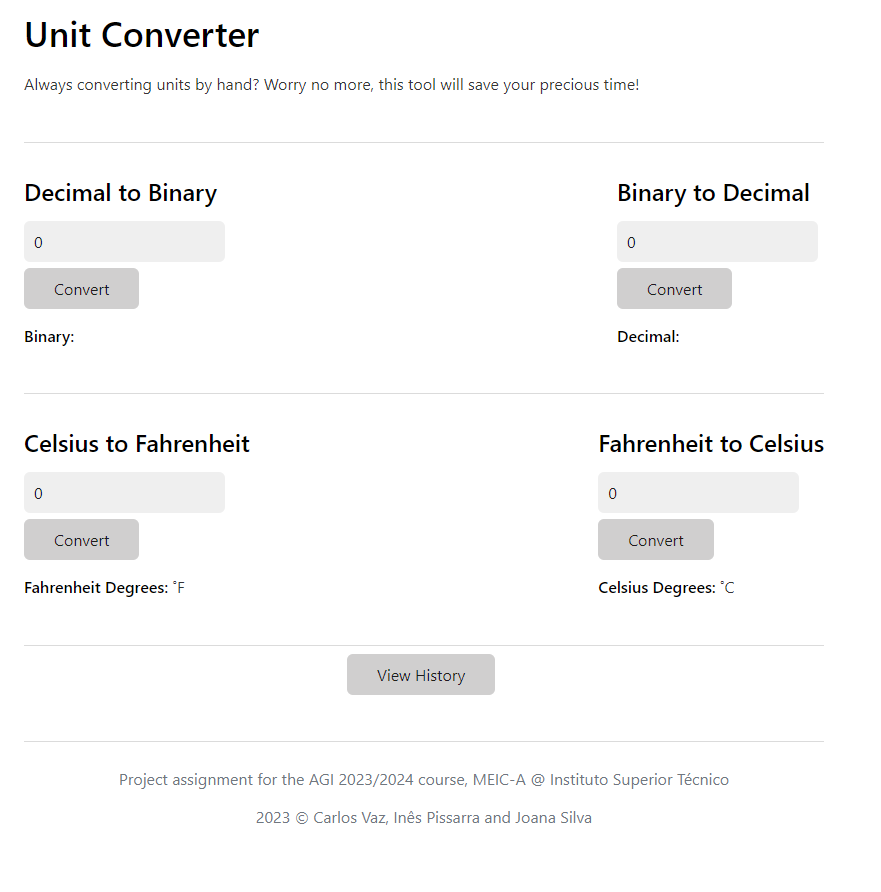
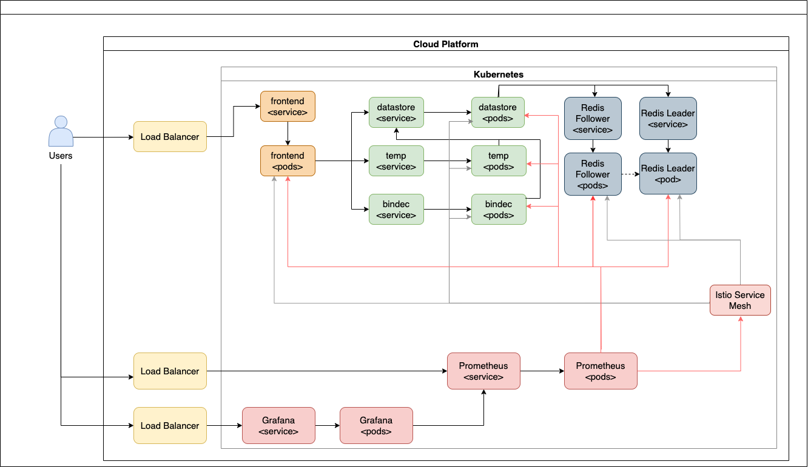
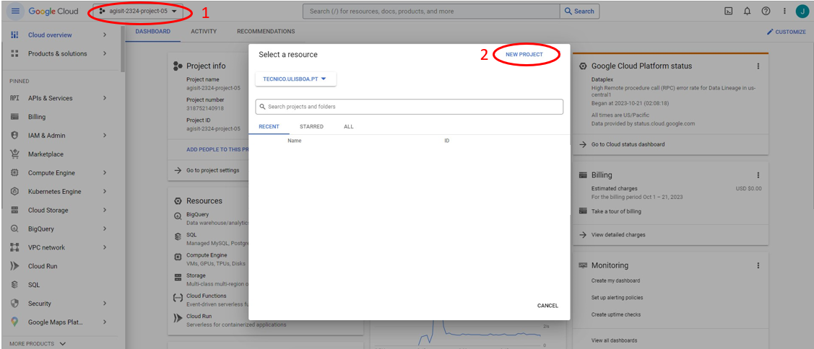
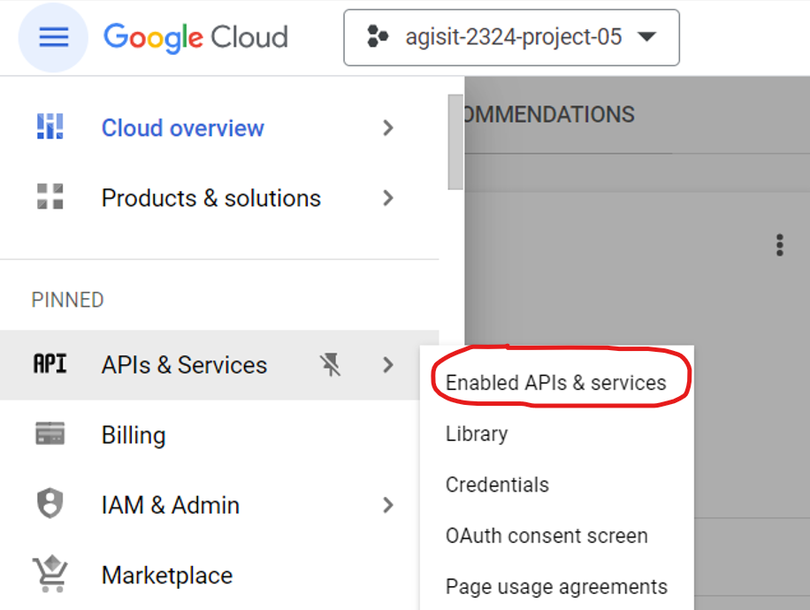
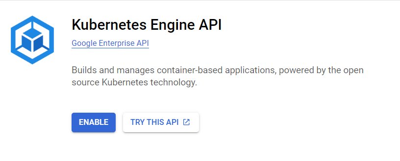
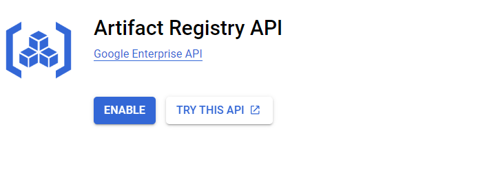
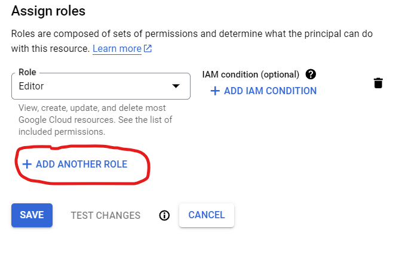
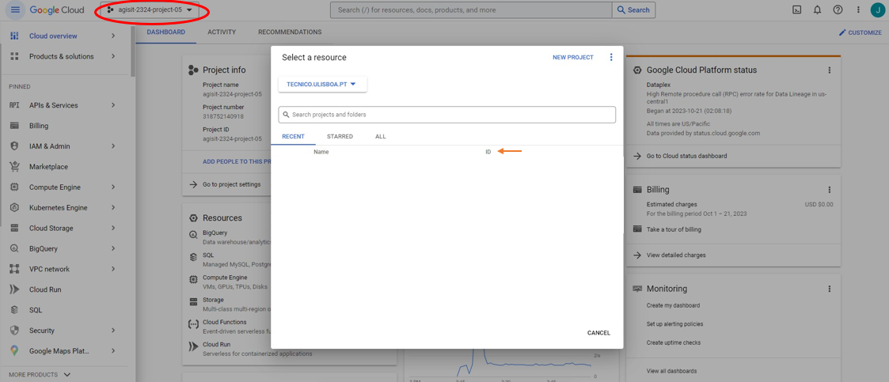
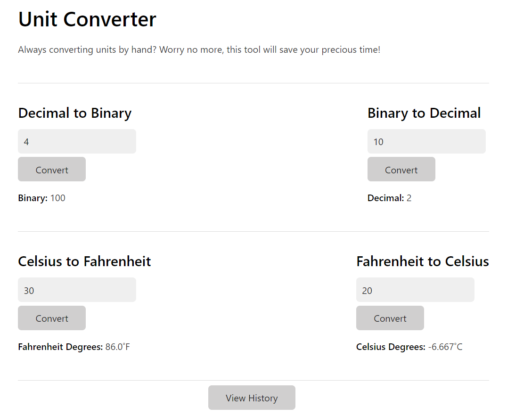
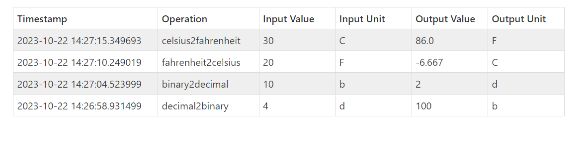

# agisit23-g5



## Unit Converter

Unit Converter is a cloud-native app that is meant to be deployed to a Kubernetes cluster.

 This application will help users convert:
- Decimal numbers to Binary and vice-versa;
- Celsius temperatures to Fahrenheit and vice-versa.

Additionaly, users can also view their past operations history.

## Architecture


### Application
Unit Converter is mainly composed of 4 microservices, all written in Python using the Flask framework, and microservices for a Redis database:

- `frontend`: is the web app entry point and exposes an HTTP server. Automatically generates a user ID and saves it as a cookie. Sends requests to `bindec` and `temp` to process conversions of user input, and requests the user's operation history from `datastore`.

- `bindec`: has two endpoints, one for converting decimal numbers to binary and another for converting binary numbers to decimal. It also makes requests to `datastore` to register new operations.

- `temp`: has two endpoints, one for converting Celsius temperatures to Fahrenheit and another for converting Fahrenheit temperatures to Celsius. It also makes requests to `datastore` to register new operations.

- `datastore`: communicates with the Redis database microservices to store new user operations, and to retrieve the user's operation history.

- `redis-leader` and `redis-follower`: Redis database in a leader-follower configuration for persistent storage of the users' operation history.

### Istio Service Mesh and Monitoring
We used Istio service mesh which exposes an endpoint that creates metrics for each target component. Then we use Prometheus to scrape the endpoints and collect data. Finally, Grafana was used to create dashboards to show the retrieved data.

## Tools Used

This repository contains the necessary files to deploy the app to a Kubernetes cluster on Google Cloud Platform's Google Kubernetes Engine, using Terraform. The app is deployed to a Kubernetes cluster with the Istio Service Mesh installed and configured. Prometheus and Grafana are also installed to monitor the cluster.

Terraform also builds the Docker images of the app's microservices and pushes them to Google Cloud's Artifact Registry.

Vagrant is used to launch a local Management Node VM that will be used to deploy the app to the Kubernetes cluster.

## The Provisioning and Deployment Modules
The provisioning and deployment files can be found in the `gcp` directory and are divided in 2 modules:

- `gcp_gke` module specifies the definition of the kubernetes cluster which includes the region where the cluster is going to be deployed and the number of nodes per zone (in our case: 1 node per zone, 3 nodes in total);

- `gcp_k8s` module specifies the application configuration: pods, services, horizontal pod autoscalers. It also configures the deployment of Istio Service Mesh, together with Prometheus and Grafana monitoring tools.
    - `k8s-provider.tf` has a list of providers: docker, helm, kubectl and kubernetes;
    - `k8s-docker.tf` builds and pushes the images to a private google cloud repository;
    - `k8s-namespaces.tf` defines 2 namespaces:
        - `application` for the application services;
        - `istio-system` for Istio Service Mesh, Prometheus and Grafana.
    - `k8s-pods.tf` defines the pods to be deployed and the initial number of replicas (in this case, we only start with 1 replica for each microservice);
    - `k8s-services.tf` defines a set of services which include the microservices and datastore;
    - `k8s-hpa.tf` configures horizontal pod autoscalers. All services, except `redis-leader`, can have up to 3 replicas depending on CPU metric;
    - `k8s-istio.tf` deploys the Istio Service Mesh;
    - `k8s-monitoring.tf` and `monitoring` folder configure Prometheus targets and Grafana dashboards.

## Deployment instructions

Start by cloning the repository and follow the next steps.

### Google Cloud Platform setup
1. Create a new project in Google Cloud Platform:



2. Go to the Google Cloud Console -> API & Services -> Enabled APIs and Services. Then, click on Enable APIs and Services, search for the following APIs and enable them:

    
    
- Kubernetes Engine API

    

- Artifact Registry API

    

3. To update some permissions associated with our service account in the GCP,
select IAM and Admin -> IAM. After that, click the edit button of the principal with the name "Compute Engine default service account" and add a new role "Kubernetes Engine Admin".

    

4. To successfully deploy the app, you need to create a credentials file:
    - On the Google Cloud Console choose IAM & Admin -> Service Accounts -> Actions -> Manage keys -> ADD KEY -> Create new key (json).
    - Save this credentials file in the `gcp/` directory.

5. Change the following files in the `gcp/` directory:
    - Update line 9 in `terraform.tfvars` with the correct Project ID. To find the Project ID:

    

    - Change line 8 in `gcp-gke-provider.tf` to the correct credentials file name.

### Management Node

#### Launching the Management Node VM

To launch the Management Node VM, open a terminal in this project's root directory and run the following commands:

Make sure to have Vagrant installed. If you don't, you can install it [here](https://developer.hashicorp.com/vagrant/downloads).

If you're on a Mac with Apple Silicon, we suggest you use the Docker provider for Vagrant (requires Docker to be installed):

```
$ ln -s Vagrantfile.docker Vagrantfile
```

Otherwise, we suggest you use the VirtualBox provider (requires VirtualBox to be installed):

```
$ ln -s Vagrantfile.vbox Vagrantfile
```
Alternatively:
- Remove `.vbox` extension;
- Or, run on the terminal `export VAGRANT_VAGRANTFILE="Vagrantfile.vbox"`.


Now, launch the VM:
```
$ vagrant up
```

To access a shell on the Management Node VM, run:
```
$ vagrant ssh
```

#### Deploying the App

First, ensure that GCP is properly configured (see above).

Now, to deploy the app, run the following commands in the Management Node shell:

```
$ cd gcp/
```

To access GCP resources through the API you need to authenticate Google Cloud SDK with the following command:

```
$ gcloud auth login
```

Follow the instructions on the terminal to authenticate: open the link on a Web browser with your
GCP account logged in (in this case, your Técnico GSuite account), copy the authorization code and paste it in the terminal.

Set the GCP project:

```
$ gcloud config set project <project-id>
```

And to double-check that it is correct:

```
$ gcloud config get-value project
```

We are now ready to deploy the app with Terraform. Start by initializing Terraform:

```
$ terraform init
```

Now, we'll do a dry run to check if everything is correct:

```
$ terraform plan
```

Finally, after checking that everything looks right, we can deploy the app:

```
$ terraform apply
```

This command will create a GKE cluster on GCP and deploy the app to it. It will take a few minutes to complete.

#### Connecting `kubectl`

To use the `kubectl` command on the Management Node shell, you'll need to connect to the cluster. To do that, open the Google Cloud Console, go to Kubernetes Engine Clusters -> Clusters, click on the name of the cluster that you want to connect to finally click on the Connect button.

A `gcloud` command will pop-up. Copy the command and paste it in the Management Node shell.

#### Useful commands

To know the IP address of the app's endpoint, run the following command:
```
$ kubectl get services -n application
```

You can now copy the external IP address of the app's frontend and open it on a Web browser with a URL like the following: `http://<external_frontend_ip_address>`.

To reach the Prometheus and Grafana dashboards, first we need to get the external IP addresses of the services:
```
$ kubectl get services -n istio-system
```

The Prometheus and Grafana dashboards are available at the following URLs, respectively:
- `http://<external_prometheus_ip_address>:9090`;

- `http://<external_grafana_ip_address>:3000`.
    - Username: admin; Password: password
    - Go to `Dashboards`->`Manage`

To check the pods that have been created:
```
$ kubectl get pods -n application
```

To check the horizontal pod autoscalers:
```
$ kubectl get hpa -n application
```

#### Destroy Resources
To destroy the cluster run on the Management Node's terminal the following command:

```
$ terraform destroy
```

To delete the images pushed to Google Cloud Repository go to the link below and delete them:

`https://console.cloud.google.com/gcr/images/<PROJECT_ID>/global/proj-images`

## Application usage
Main Page:



View History Tab:




## Authors

- Carlos Vaz, 99188, [GitLab link](https://gitlab.rnl.tecnico.ulisboa.pt/ist199188)
- Inês Pissarra, 99236, [GitLab link](https://gitlab.rnl.tecnico.ulisboa.pt/ist199236)
- Joana Silva, 99242, [GitLab link](https://gitlab.rnl.tecnico.ulisboa.pt/ist199242)